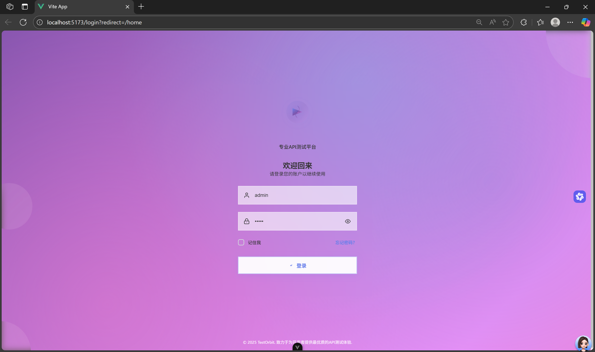
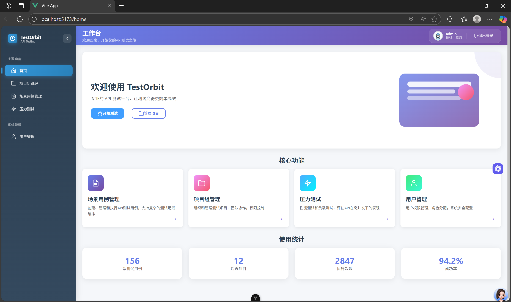
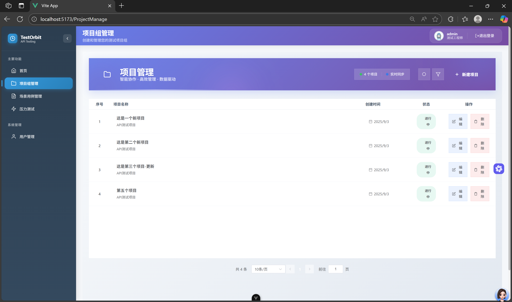
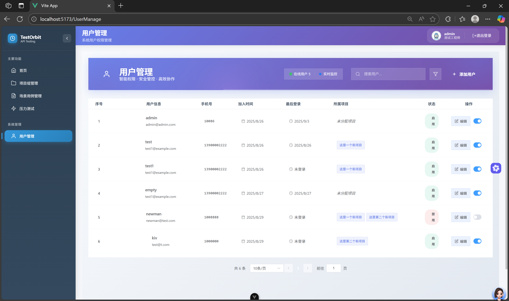
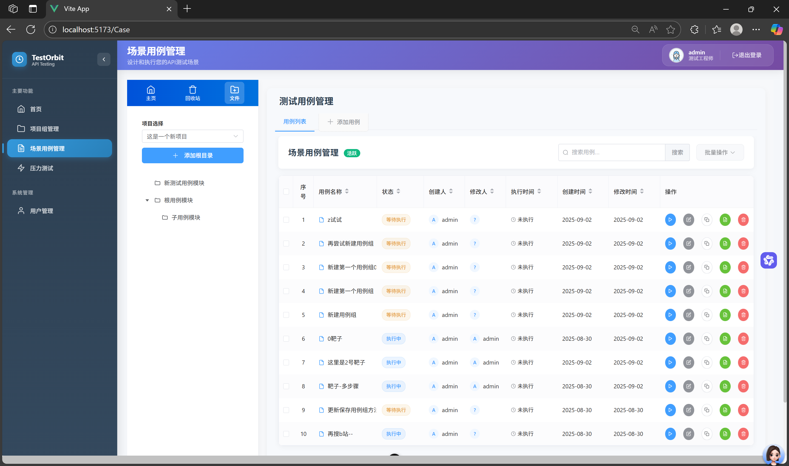
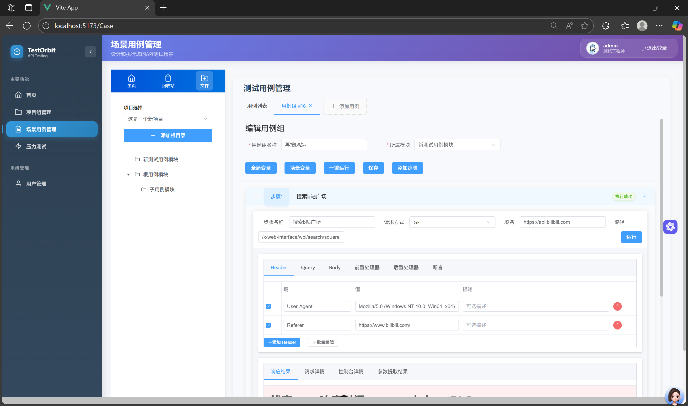

# TestOrbit - 接口自动化测试平台


TestOrbit 是一个功能强大的接口自动化测试平台，旨在帮助开发和测试团队简化和自动化API测试流程。它提供了从用例管理、测试执行到报告生成的全方位解决方案。

## 目录

- [功能特性](#功能特性)
- [项目展示](#项目展示)
- [技术栈](#技术栈)
- [项目结构](#项目结构)
- [快速上手](#快速上手)
  - [环境准备](#环境准备)
  - [后端启动](#后端启动)
  - [前端启动](#前端启动)
- [贡献指南](#贡献指南)
- [License](#license)

## 功能特性

- **用户与权限管理**: 支持多用户协作，通过角色控制不同用户对项目和功能的访问权限。
- **项目管理**: 集中管理所有测试项目，使项目信息一目了然。
- **测试用例管理**:
  - **用例组**: 支持对测试用例进行分组管理（CURD）。
  - **步骤编辑器**: 在用例组内，可以对单个测试步骤进行增删改查、调试和顺序调整。
  - **变量管理**: 支持全局变量和局部变量，方便在不同测试场景中传递和管理数据。
- **自动化测试执行**:
  - **批量执行**: 支持选择多个用例组进行批量执行。
  - **定时任务**: 可设置定时任务，实现无人值守的自动化回归测试。
- **测试报告**:
  - **报告生成与查询**: 每次执行后都会生成详细的测试报告，并支持历史报告的查询。
  - **邮件通知**: 测试完成后，可自动将测试报告发送给指定的项目负责人。
- **回收站**: 提供用例组回收站功能，防止误删，方便恢复。

## 项目展示

以下是 TestOrbit 平台的主要界面展示：

### 登录界面


### 首页概览


### 项目管理


### 用户管理


### 用例组管理


### 测试步骤编辑


## 技术栈

- **前端**:
  - [Vue 3](https://vuejs.org/)
  - [TypeScript](https://www.typescriptlang.org/)
  - [Vite](https://vitejs.dev/)
  - [Element Plus](https://element-plus.org/)
  - [Pinia](https://pinia.vuejs.org/)
  - [Axios](https://axios-http.com/)

- **后端**:
  - [Django](https://www.djangoproject.com/)
  - [Django REST Framework](https://www.django-rest-framework.org/)
  - [Celery](https://docs.celeryq.dev/) (用于异步任务处理和定时任务)
  - [MySQL](https://www.mysql.com/)
  - [Redis](https://redis.io/) (作为Celery的消息代理)

## 项目结构

```
TestOrbit/
├── TestOrbit_backend/      # 后端 Django 项目
│   ├── apiData/            # 核心业务应用
│   ├── config/             # 配置相关应用
│   ├── project/            # 项目管理应用
│   ├── user/               # 用户管理应用
│   ├── utils/              # 公共工具模块
│   ├── TestOrbit/          # Django 项目主配置
│   ├── manage.py           # Django 管理脚本
│   └── requirements.txt    # 后端依赖
│
└── TestOrbit_frontend/     # 前端 Vue 项目
    ├── src/                # 前端源码
    │   ├── api/            # API 请求
    │   ├── assets/         # 静态资源
    │   ├── components/     # 公共组件
    │   ├── router/         # 路由配置
    │   ├── store/          # Pinia 状态管理
    │   └── views/          # 页面视图
    ├── package.json        # 前端依赖和脚本
    └── vite.config.ts      # Vite 配置文件
```

## 快速上手

### 环境准备

- [Node.js](https://nodejs.org/) (>=20.0.0)
- [Python](https://www.python.org/) (>=3.10)
- [MySQL](https://www.mysql.com/) (>=8.0)
- [Redis](https://redis.io/)

### 后端启动

1.  **进入后端目录**
    ```shell
    cd TestOrbit_backend
    ```

2.  **创建并激活虚拟环境** (推荐)
    ```shell
    python -m venv venv
    .\venv\Scripts\activate  # Windows
    # source venv/bin/activate  # macOS/Linux
    ```

3.  **安装依赖**
    ```shell
    pip install -r requirements.txt
    ```

4.  **配置数据库**
    - 打开 `TestOrbit_backend/TestOrbit/settings.py` 文件。
    - 修改 `DATABASES` 配置，填入您自己的 MySQL 数据库信息。
    - 同时，请确保您已创建了对应的数据库。

5.  **数据库迁移**
    ```shell
    python manage.py makemigrations
    python manage.py migrate
    ```

6.  **创建超级管理员**
    ```shell
    python manage.py createsuperuser
    ```
    然后按照提示输入用户名、邮箱和密码。

7.  **启动后端服务**
    ```shell
    python manage.py runserver
    ```
    服务将默认运行在 `http://127.0.0.1:8000`。

### 前端启动

1.  **进入前端目录**
    ```shell
    cd TestOrbit_frontend
    ```

2.  **安装依赖**
    ```shell
    npm install
    ```

3.  **启动前端开发服务**
    ```shell
    npm run dev
    ```
    服务将默认运行在 `http://localhost:5173`，并会自动在浏览器中打开。

## 贡献指南

我们欢迎任何形式的贡献！如果您想为 TestOrbit 做出贡献，请遵循以下步骤：

1.  **Fork** 本仓库。
2.  创建一个新的分支 (`git checkout -b feature/YourFeature`)。
3.  提交您的更改 (`git commit -m 'Add some feature'`)。
4.  将您的分支推送到远程仓库 (`git push origin feature/YourFeature`)。
5.  创建一个 **Pull Request**。

## License

本项目采用 [MIT License](LICENSE) 开源许可。